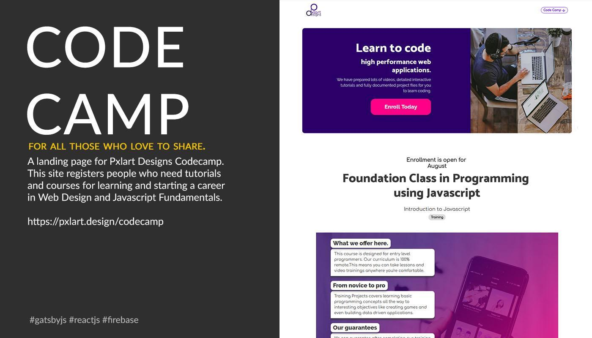

# Codecamp landing webpage
Using the default Gatsby starter to build a pretty landing page for the 2018 CodeCamp I held in Lagos, Nigeria. I used the awesome @reactjs @gastbyjs

## Screenshot

## Deploy

